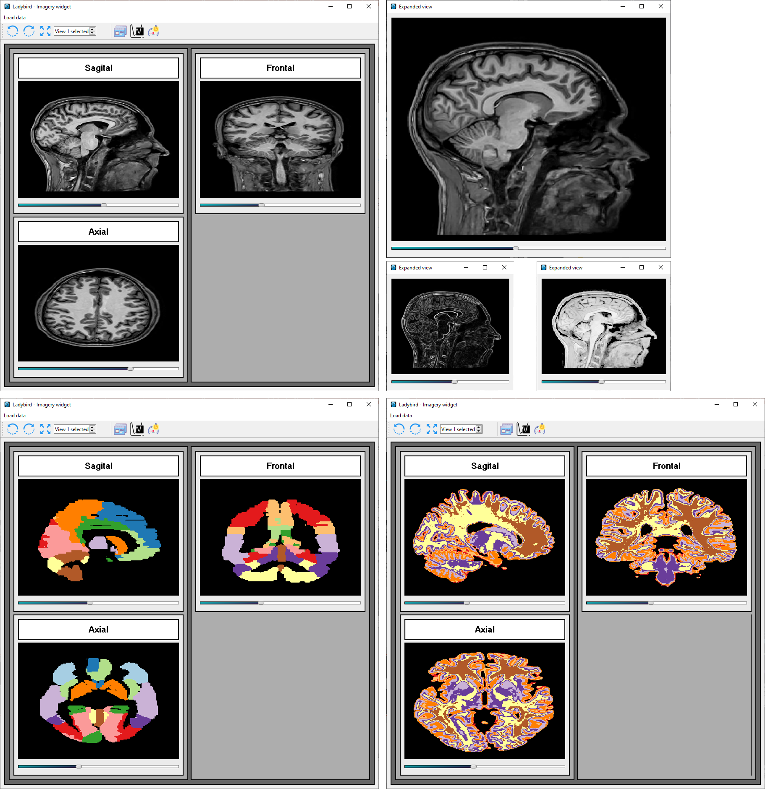

# 1. MRI viewer
This simple app allow users to navigate through 3D medical images such as MRI or PET scans. The most common image formats are accepted:
1. NIfTI
2. DICOM
3. Compressed files

Clinical/research images can be loaded. Several atlases are also available in the shared database. On the other hand, users can either:
- Zoom in on an anatomical plan
- Rotate images
- Apply kernels

# 2. Example using the GUI
To run the program, user can either open the script "_**start_app.py**_" using the terminal, or simply double click the "_**start_app**_" file, that should automatically launch the GUI.

```
> cd root\ladybird_MRI_app
> python start_app.py
```



# 3. Requirements
Listed in "_**requirements.txt**_".

```
> pip install -r requirements.txt
```

# 4. References
- MRI atlases: https://www.nitrc.org/projects/mricron
- Toolbar icones: https://icons8.com/
