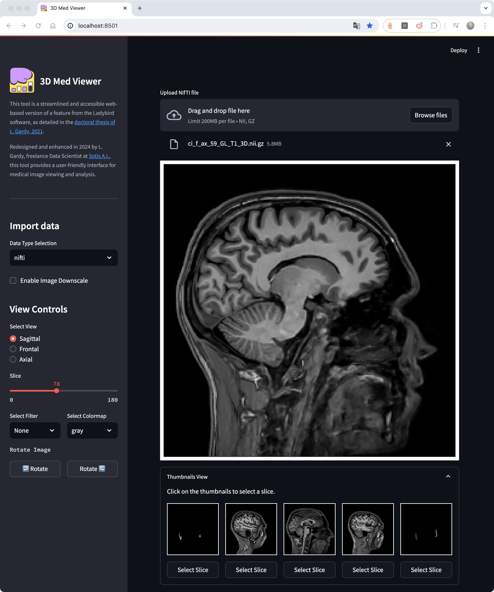
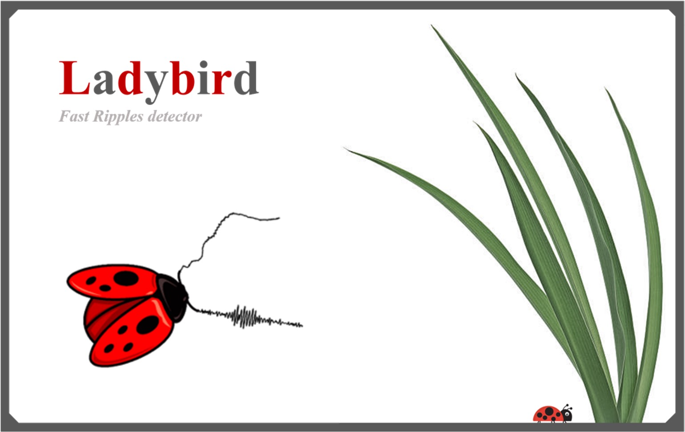
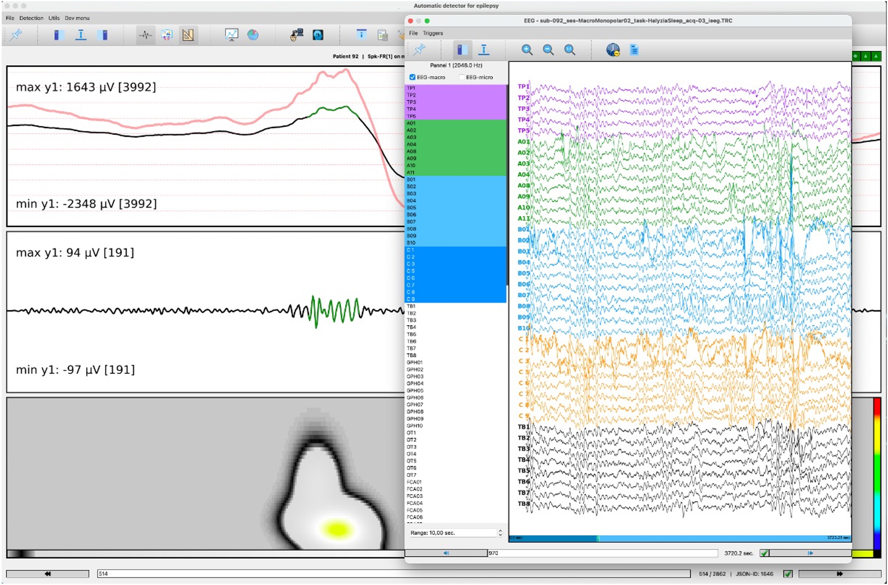
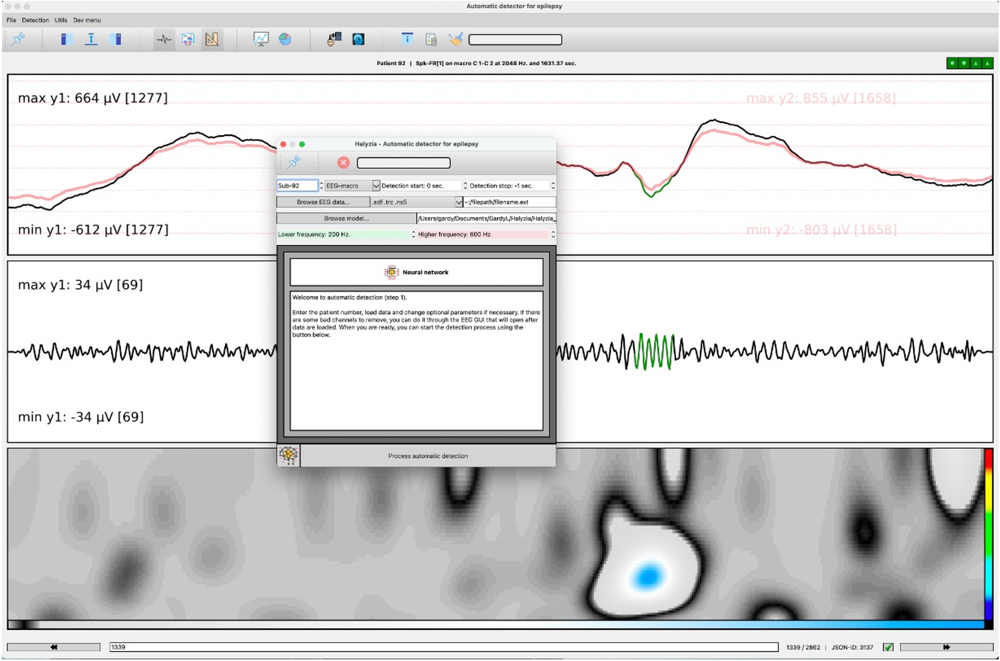
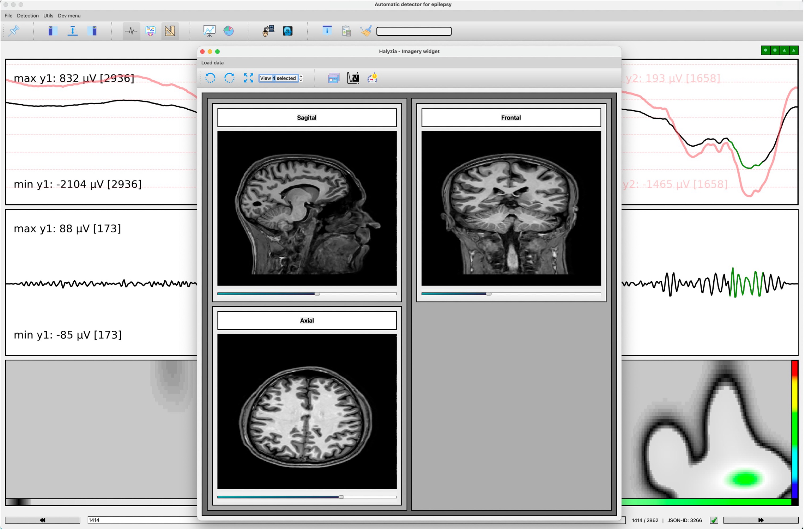
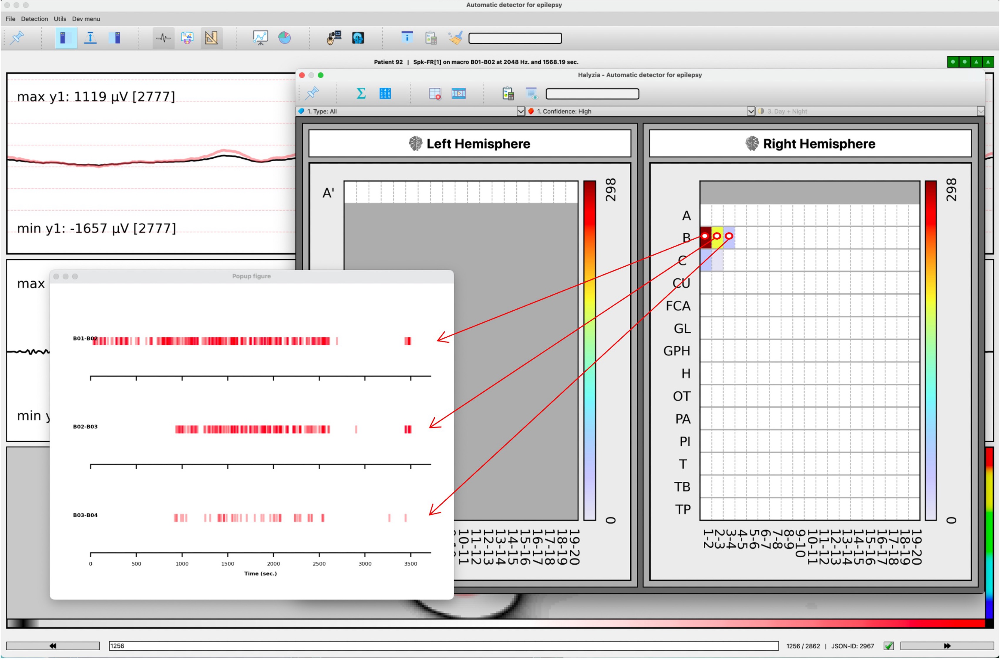
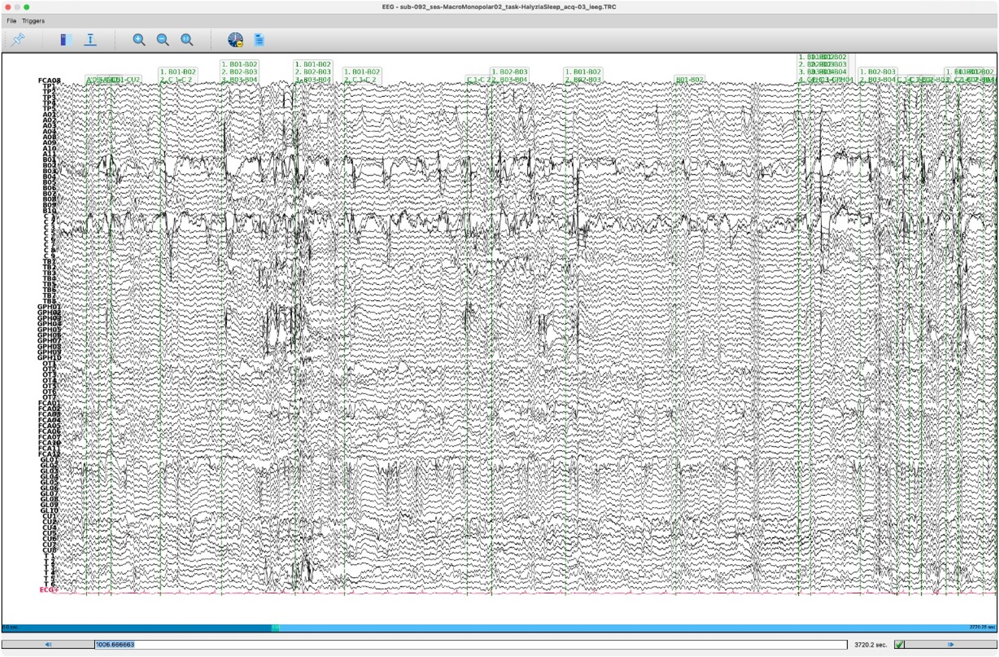

# Ladybird MRI & Medical Scanner Viewer

## 📄 Description

This repository showcases a component of [Ladybird](#about-ladybird) dedicated to the visualization and manipulation of 3D medical images, including MRI and PET scans. Operating independently from the complete software suite, this component provides standalone capabilities for navigating and analyzing medical images.

The MRI viewer included in this repository provides robust tools for navigating and interacting with 3D medical images. It supports a wide range of common image formats, including NIfTI (compressed `.nii.gz` and uncompressed `.nii`) and DICOM. Users can load both clinical and research images, with several atlases accessible from the shared database. Key functionalities include zooming in on specific anatomical planes, rotating images, and applying various image processing filters. This tool is designed to facilitate detailed analysis and enhance the visualization of medical imaging data.

⚠️ Please note that this MRI viewer is still under development and has not been validated by any regulatory authority. It was developed as part of research projects and is intended as a side project with no major pretensions.

🌐 Access the app and start your analysis now at [https://medviewer.sotisai.com](https://medviewer.sotisai.com).

---

## ⚙️ Setup & Usage

You can run the application in two ways:

- **Locally using `uv`**
- **Using Docker Compose**

### 🔧 Option 1 — Run Locally with `uv`

> `uv` is a fast and modern Python tool that handles virtual environments and dependencies via `pyproject.toml`.

1. **Install `uv`** (if not already installed)  
   ```bash
   curl -Ls https://astral.sh/uv/install.sh | sh
   ```

2. **Clone the repository**  
   ```bash
   git clone https://github.com/LudovicGardy/app_name
   cd app_folder/
   ```

3. **Create and activate the environment**  
   ```bash
   uv venv
   ```

   - On **macOS/Linux**:
     ```bash
     source .venv/bin/activate
     ```

   - On **Windows** (PowerShell):
     ```powershell
     .venv\Scripts\Activate.ps1
     ```

4. **(Optional) If the virtual environment doesn't behave properly**

   Sometimes, on macOS in particular, the environment might be missing some tooling (like `pip`). You can try the following fixes:

   ```bash
   .venv/bin/python -m ensurepip --upgrade
   .venv/bin/python -m pip install --upgrade pip
   # Optional: Only if you need to use Jupyter notebooks
   .venv/bin/python -m pip install ipykernel -U --force-reinstall
   ```

5. **Launch the app**  
   ```bash
   streamlit run main.py
   ```

### 🐳 Option 2 — Run with Docker Compose

1. **Make sure Docker and Docker Compose are installed and running**

2. **Go to the project directory**
   ```bash
   cd path/to/app_folder
   ```

3. **Build and start the app**
   ```bash
   docker-compose up --build
   ```

4. **Access the app**
   Open your browser at: [http://localhost:8505](http://localhost:8505)

---

## 📱 Running the App using PyQt or Streamlit

### PyQt version
```sh
python main_local.py  # Launches the local GUI
```


### Streamlit version (default)
The local version of the MRI viewer has been adapted for web deployment using Streamlit. This web version offers comparable functionalities as the local version, with a user-friendly interface accessible from any web browser. To run the web version, execute the `main_web.py` script and open the provided URL in your browser.
The web version of the MRI viewer is designed to be accessible and easy to use, with a streamlined interface that simplifies the process of loading and viewing medical images. While the local version offers more advanced features and capabilities, the web version provides a convenient alternative for users who prefer a browser-based interface.

```sh
streamlit run main_web.py  # Launches the web GUI
```



⚠️ The PyQt (local) version being less generic and more difficult to maintain, it will not be updated in the future. Only the web version will be maintained and updated if necessary.

---

## 🛠️ Development

### Pre-commit Hooks

This project uses pre-commit to maintain code quality. The following hooks are configured:

- **Basic hooks**: checking for trailing whitespaces, end-of-file formatting, YAML and TOML file verification, etc.
- **Ruff**: Python code linting and formatting
- **Codespell**: spell checking
- **Commitizen**: checking commit messages according to the defined convention

To install pre-commit:

```bash
# Install dependencies
uv pip install pre-commit ruff

# Install git hooks
pre-commit install
```

The hooks will run automatically with each commit. You can also run them manually:

```bash
pre-commit run --all-files  # Run on all files
pre-commit run ruff         # Run a specific hook
```

Ruff configuration is defined in `pyproject.toml` and includes:
- reStructuredText docstring format
- Import checking
- Double quote formatting
- Line length limited to 100 characters

---

## 📚 References
- MRI atlases: https://www.nitrc.org/projects/mricron
- Toolbar icones: https://icons8.com/

#### About Ladybird
Ladybird, developed during [L. Gardy's doctoral research](http://thesesups.ups-tlse.fr/5164/1/2021TOU30190.pdf) under the guidance of [E. Barbeau](https://cerco.cnrs.fr/page-perso-emmanuel-j-barbeau-ph-d/) (neuroscientist, CNRS) and [C. Hurter](http://recherche.enac.fr/~hurter/presentation.html) (engineer, ENAC), is a sophisticated software designed for the automatic detection of fast-ripples (FRs) in epilepsy. Originally developed by L. Gardy, with significant input from various researchers and medical professionals the early trials in the neurology department at Toulouse Hospital, along with support from various academic and economic entities, led to widespread enthusiasm and substantial funding, allowing for further development and eventual patenting ([Brevet: FR3128111](https://data.inpi.fr/brevets/FR3128111)). Ladybird was later rebranded as Halyzia©, a name change necessitated for trademark reasons, and is now being further developed and commercialized by the French startup Avrio MedTech.

<table style="width:100%;">
  <tr>
    <td style="width:50%;"></td>
    <td style="width:50%;"></td>
  </tr>
  <tr>
    <td style="width:50%;"></td>
    <td style="width:50%;"></td>
  </tr>
  <tr>
    <td style="width:50%;"></td>
    <td style="width:50%;"></td>
  </tr>
</table>

---

## 👤 Author
- LinkedIn: [Ludovic Gardy](https://www.linkedin.com/in/ludovic-gardy/)
- Doctoral thesis: [PDF](http://thesesups.ups-tlse.fr/5164/1/2021TOU30190.pdf)